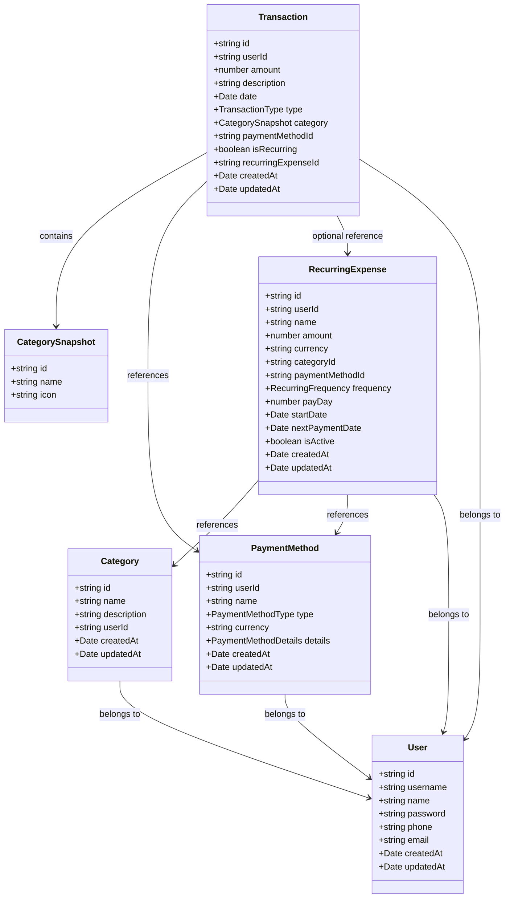
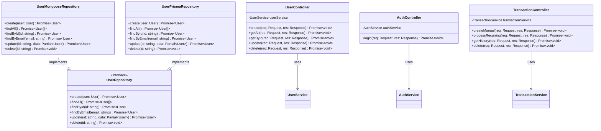
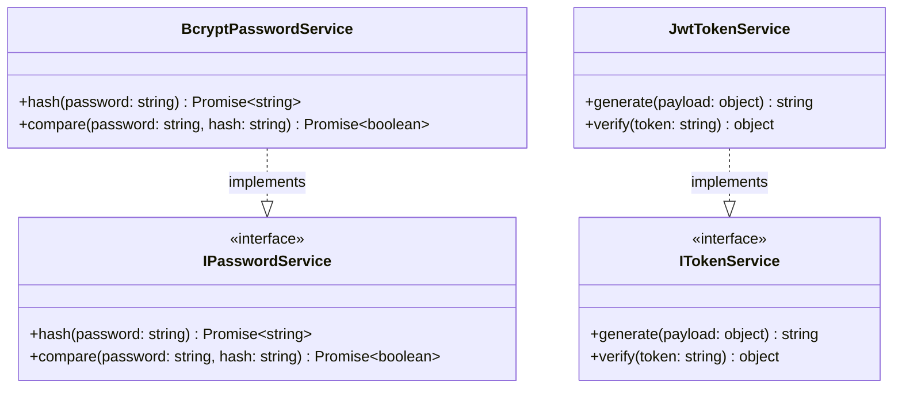
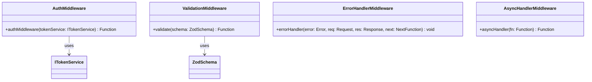

# Financial App API - Executive Summary

## 📋 Table of Contents
1. [Overview](#overview)
2. [Architecture](#architecture)
3. [Technology Stack](#technology-stack)
4. [Architecture Diagram](#architecture-diagram)
5. [Class Diagrams](#class-diagrams)
6. [Data Models](#data-models)
7. [API Endpoints](#api-endpoints)
8. [Key Features](#key-features)
9. [Security](#security)
10. [Project Structure](#project-structure)

---

## 🎯 Overview

**Financial App API** is a personal finance management system developed with TypeScript and Node.js. It allows users to manage their income, expenses, payment methods, categories, and recurring expenses in an organized and secure manner.

### Project Objective
Provide a robust and scalable RESTful API for personal finance management, following Clean Architecture principles and development best practices.

### Key Features
- ✅ JWT Authentication
- ✅ User Management
- ✅ Transaction Categorization
- ✅ Multiple Payment Methods (Credit Card, Bank Account, Cash)
- ✅ Manual Transactions and Income
- ✅ Recurring Expenses with Automatic Processing
- ✅ Transaction History with Advanced Filters
- ✅ Payment Date Calculation for Credit Cards
- ✅ Multi-Database Support (MongoDB, MySQL)

---

## 🏗️ Architecture

The project follows **Clean Architecture** with clear separation of responsibilities across three main layers:

### 1. **Domain Layer** (`domain/`)
- **Types and Entities**: Defines business data structures
- **Repository Interfaces**: Contracts for data access
- **Domain Services**: Pure business logic
- **Domain Errors**: Custom exceptions

### 2. **Application Layer** (`application/`)
- **Application Services**: Orchestrate use cases
- **DTOs (Data Transfer Objects)**: Input/output data validation and transformation
- **Zod Validation**: Schemas for data validation

### 3. **Infrastructure Layer** (`infra/`)
- **HTTP Controllers**: Handle requests/responses
- **Routes**: REST endpoint definitions
- **Repositories**: Concrete implementations (MongoDB, Prisma, In-Memory)
- **Middleware**: Authentication, validation, error handling
- **Database Clients**: Mongoose, Prisma
- **Infrastructure Services**: Bcrypt, JWT

### Applied Principles
- **Dependency Inversion**: Upper layers depend on abstractions
- **Single Responsibility**: Each class has a single responsibility
- **Separation of Concerns**: Clear separation between layers
- **Interface Segregation**: Specific and cohesive interfaces

---

## 💻 Technology Stack

### Runtime and Language
- **Node.js** with **TypeScript 5.9.3**
- **Express.js 5.1.0** (Web framework)

### Databases
- **MongoDB** (Primary) - Mongoose 9.0.0
- **MySQL** (Alternative) - Prisma 7.0.0

### Authentication and Security
- **JWT** (jsonwebtoken 9.0.2) - Authentication tokens
- **Bcrypt 6.0.0** - Password hashing

### Validation
- **Zod 4.1.12** - Schema validation

### Development
- **ts-node-dev** - Hot reload in development
- **dotenv** - Environment variable management

### Containers
- **Docker Compose** - Local MongoDB and MySQL

---

## 📐 Architecture Diagram

```
┌─────────────────────────────────────────────────────────────┐
│                    HTTP Layer (Express)                      │
│  ┌──────────────┐  ┌──────────────┐  ┌──────────────┐      │
│  │  Controllers │  │   Routes     │  │  Middleware  │      │
│  └──────┬───────┘  └──────┬───────┘  └──────┬───────┘      │
└─────────┼──────────────────┼─────────────────┼──────────────┘
          │                  │                 │
          ▼                  ▼                 ▼
┌─────────────────────────────────────────────────────────────┐
│              Application Layer (Services)                     │
│  ┌──────────────┐  ┌──────────────┐  ┌──────────────┐      │
│  │ UserService  │  │ AuthService  │  │TransactionSvc│      │
│  │CategorySvc   │  │PaymentMethod │  │RecurringSvc  │      │
│  └──────┬───────┘  └──────┬───────┘  └──────┬───────┘      │
└─────────┼──────────────────┼─────────────────┼──────────────┘
          │                  │                 │
          ▼                  ▼                 ▼
┌─────────────────────────────────────────────────────────────┐
│                 Domain Layer (Business Logic)                │
│  ┌──────────────┐  ┌──────────────┐  ┌──────────────┐      │
│  │  Types       │  │ Repositories │  │   Services   │      │
│  │  (Interfaces)│  │ (Interfaces) │  │ (Interfaces) │      │
│  └──────────────┘  └──────────────┘  └──────────────┘      │
└─────────┼──────────────────┼─────────────────┼──────────────┘
          │                  │                 │
          ▼                  ▼                 ▼
┌─────────────────────────────────────────────────────────────┐
│            Infrastructure Layer (Implementations)            │
│  ┌──────────────┐  ┌──────────────┐  ┌──────────────┐      │
│  │  Repositories│  │   Database   │  │   Services   │      │
│  │  (MongoDB/   │  │   Clients    │  │  (Bcrypt/    │      │
│  │   Prisma)    │  │ (Mongoose/   │  │   JWT)       │      │
│  │              │  │   Prisma)    │  │              │      │
│  └──────────────┘  └──────────────┘  └──────────────┘      │
└─────────────────────────────────────────────────────────────┘
```

---

## 📊 Class Diagrams

### 1. Domain Layer - Main Entities



### 2. Application Layer - Services

```mermaid
classDiagram
    class UserService {
        -UserRepository userRepository
        -IPasswordService passwordService
        +create(data: CreateUserDto) Promise~User~
        +findAll() Promise~User[]~
        +findById(id: string) Promise~User~
        +update(id: string, data: UpdateUserDto) Promise~User~
        +delete(id: string) Promise~void~
    }
    
    class AuthService {
        -UserRepository userRepository
        -ITokenService tokenService
        -IPasswordService passwordService
        +login(loginData: LoginDto) Promise~LoginResponse~
    }
    
    class CategoryService {
        -CategoryRepository categoryRepository
        +create(data: CreateCategoryDto, userId: string) Promise~Category~
        +findAll(userId: string) Promise~Category[]~
        +findById(id: string, userId: string) Promise~Category~
        +update(id: string, data: UpdateCategoryDto, userId: string) Promise~Category~
        +delete(id: string, userId: string) Promise~void~
    }
    
    class TransactionService {
        -TransactionRepository transactionRepository
        -CategoryRepository categoryRepository
        -PaymentMethodRepository paymentMethodRepository
        +createManual(data: CreateTransactionDto, userId: string) Promise~Transaction~
        +processRecurring(recurringExpenseId: string, userId: string) Promise~Transaction~
        +getHistory(filters: TransactionFilters, userId: string) Promise~Transaction[]~
        +delete(id: string, userId: string) Promise~void~
    }
    
    class RecurringExpenseService {
        -RecurringExpenseRepository recurringExpenseRepository
        -CategoryRepository categoryRepository
        -PaymentMethodRepository paymentMethodRepository
        +create(data: CreateRecurringDto, userId: string) Promise~RecurringExpense~
        +findAll(userId: string) Promise~RecurringExpense[]~
        +update(id: string, data: UpdateRecurringDto, userId: string) Promise~RecurringExpense~
        +delete(id: string, userId: string) Promise~void~
    }
    
    class PaymentMethodService {
        -PaymentMethodRepository paymentMethodRepository
        +create(data: CreatePaymentMethodDto, userId: string) Promise~PaymentMethod~
        +findAll(userId: string) Promise~PaymentMethod[]~
        +calculateDueDate(paymentMethodId: string, transactionDate: Date, userId: string) Promise~Date~
        +delete(id: string, userId: string) Promise~void~
    }
    
    UserService --> UserRepository : uses
    AuthService --> UserRepository : uses
    CategoryService --> CategoryRepository : uses
    TransactionService --> TransactionRepository : uses
    RecurringExpenseService --> RecurringExpenseRepository : uses
    PaymentMethodService --> PaymentMethodRepository : uses
```



### 3. Infrastructure Layer - Repositories and Controllers



### 4. Infrastructure Services



### 5. Middleware and Utilities



---

## 📦 Data Models

### User
```typescript
{
  id: string;                    // UUID
  username: string;               // 1-100 characters
  name: string;                   // 1-100 characters
  password: string;               // Hashed with bcrypt (never exposed)
  phone: string;                  // 1-100 characters
  email: string;                   // Unique email
  createdAt: Date;
  updatedAt: Date;
}
```

### Category
```typescript
{
  id: string;
  name: string;                   // Required
  description?: string;           // Optional
  userId: string;                 // Owner
  createdAt: Date;
  updatedAt: Date;
}
```

### PaymentMethod
```typescript
{
  id: string;
  userId: string;
  name: string;
  type: 'CREDIT_CARD' | 'BANK_ACCOUNT' | 'CASH';
  currency: string;
  details: CreditCardDetails | BankAccountDetails | CashDetails;
  createdAt: Date;
  updatedAt: Date;
}

// CreditCardDetails
{
  cut_off_day: number;      // 1-31: Statement closing day
  payment_day: number;       // 1-31: Payment due date
  credit_limit: number;
  current_balance: number;
}

// BankAccountDetails
{
  bank_name: string;
  account_number: string;    // Last 4 digits
  account_type: 'SAVINGS' | 'CHECKING';
}

// CashDetails
{}  // Empty object
```

### Transaction
```typescript
{
  id: string;
  userId: string;
  amount: number;                 // Positive
  description: string;             // 1-500 characters
  date: Date;                      // ISO 8601
  type: 'INCOME' | 'EXPENSE';
  category: CategorySnapshot;       // Embedded snapshot
  paymentMethodId: string;
  isRecurring: boolean;
  recurringExpenseId?: string;     // Optional
  createdAt: Date;
  updatedAt: Date;
}

// CategorySnapshot (embedded in Transaction)
{
  id: string;
  name: string;
  icon?: string;
}
```

### RecurringExpense
```typescript
{
  id: string;
  userId: string;
  name: string;                   // 1-100 characters
  amount: number;                 // Positive
  currency: string;               // 1-10 characters
  categoryId: string;
  paymentMethodId: string;
  frequency: 'WEEKLY' | 'MONTHLY' | 'YEARLY';
  payDay: number;                 // 1-31
  startDate: Date;
  nextPaymentDate: Date;
  isActive: boolean;              // Default: true
  createdAt: Date;
  updatedAt: Date;
}
```

---

## 🔌 API Endpoints

### Authentication
| Method | Endpoint | Description | Authentication |
|--------|----------|-------------|----------------|
| POST | `/auth/login` | User login | ❌ Public |

### Users
| Method | Endpoint | Description | Authentication |
|--------|----------|-------------|----------------|
| POST | `/users` | Create user | ❌ Public |
| GET | `/users` | List all users | ❌ Public |
| GET | `/users/:id` | Get user by ID | ❌ Public |
| PUT | `/users/:id` | Update user | ❌ Public |
| DELETE | `/users/:id` | Delete user | ❌ Public |

### Categories
| Method | Endpoint | Description | Authentication |
|--------|----------|-------------|----------------|
| POST | `/categories` | Create category | ✅ Protected |
| GET | `/categories` | List user categories | ✅ Protected |
| GET | `/categories/:id` | Get category by ID | ✅ Protected |
| PUT | `/categories/:id` | Update category | ✅ Protected |
| DELETE | `/categories/:id` | Delete category | ✅ Protected |

### Payment Methods
| Method | Endpoint | Description | Authentication |
|--------|----------|-------------|----------------|
| POST | `/payment-methods` | Create payment method | ✅ Protected |
| GET | `/payment-methods` | List user payment methods | ✅ Protected |
| GET | `/payment-methods/:id/calculate-due-date` | Calculate payment due date | ✅ Protected |
| DELETE | `/payment-methods/:id` | Delete payment method | ✅ Protected |

### Transactions
| Method | Endpoint | Description | Authentication |
|--------|----------|-------------|----------------|
| POST | `/transactions/manual` | Create manual transaction | ✅ Protected |
| POST | `/transactions/recurring/:recurringExpenseId` | Process recurring payment | ✅ Protected |
| GET | `/transactions/history` | History with filters | ✅ Protected |
| DELETE | `/transactions/:id` | Delete transaction | ✅ Protected |

**History Filters:**
- `startDate`: Start date (ISO 8601)
- `endDate`: End date (ISO 8601)
- `type`: 'INCOME' | 'EXPENSE'
- `categoryId`: Category ID

### Recurring Expenses
| Method | Endpoint | Description | Authentication |
|--------|----------|-------------|----------------|
| POST | `/recurring-expenses` | Create recurring expense | ✅ Protected |
| GET | `/recurring-expenses` | List user recurring expenses | ✅ Protected |
| PUT | `/recurring-expenses/:id` | Update recurring expense | ✅ Protected |
| DELETE | `/recurring-expenses/:id` | Delete recurring expense | ✅ Protected |

### Health Check
| Method | Endpoint | Description | Authentication |
|--------|----------|-------------|----------------|
| GET | `/health` | System status | ❌ Public |

---

## ✨ Key Features

### 1. Authentication and Authorization
- JWT-based authentication
- Password hashing with bcrypt
- Authentication middleware for protected endpoints
- Token validation on every protected request

### 2. User Management
- Complete user CRUD
- Unique email validation
- Automatic password hashing
- Responses without exposing passwords

### 3. Categorization
- User-specific custom categories
- Optional description
- Data isolation per user
- Snapshots in transactions to preserve history

### 4. Payment Methods
- **Credit Card**: Management of limits, balances, cut-off and payment days
- **Bank Account**: Savings or checking accounts
- **Cash**: Simple method without additional details
- Automatic payment date calculation for credit cards

### 5. Transactions
- **Manual Transactions**: Manually recorded income and expenses
- **Recurring Transactions**: Generated from recurring expenses
- History with advanced filters (date, type, category)
- Category snapshots to preserve historical data
- Descending date ordering

### 6. Recurring Expenses
- Configuration of subscriptions and fixed payments
- Frequencies: Weekly, Monthly, Yearly
- Automatic next payment date calculation
- Manual payment processing
- Active/inactive status

### 7. Validation and Error Handling
- Zod validation on all endpoints
- Descriptive error messages
- Appropriate HTTP codes (200, 201, 204, 400, 401, 403, 404, 500)
- Centralized error handling

### 8. Multi-Database
- MongoDB support (primary)
- MySQL/Prisma support (alternative)
- In-memory repository for testing
- Easy implementation swapping

---

## 🔒 Security

### Implemented Measures
1. **Password Hashing**: Bcrypt with automatic salt
2. **JWT Tokens**: Signed tokens with expiration
3. **Input Validation**: Zod schemas on all endpoints
4. **Authorization**: Users only access their own resources
5. **Generic Messages**: "Invalid credentials" to prevent enumeration
6. **Secure Headers**: `Bearer <token>` format validation
7. **Sanitization**: No password exposure in responses

### Authentication Flow
```
1. User sends email/password → POST /auth/login
2. System validates credentials
3. If valid → Generates JWT with { id: userId }
4. Returns token + user data (without password)
5. Client includes token in header: Authorization: Bearer <token>
6. Middleware validates token on every protected request
7. Extracts userId from token and attaches to request
```

---

## 📁 Project Structure

```
api/
├── src/
│   ├── application/              # Application Layer
│   │   ├── dto/                  # Data Transfer Objects
│   │   │   ├── auth/
│   │   │   ├── category/
│   │   │   ├── finance/
│   │   │   ├── payment-method/
│   │   │   └── user/
│   │   └── services/             # Application services
│   │       ├── auth.service.ts
│   │       ├── category.service.ts
│   │       ├── payment-method.service.ts
│   │       ├── recurring-expense.service.ts
│   │       ├── transaction.service.ts
│   │       └── user.service.ts
│   │
│   ├── domain/                   # Domain Layer
│   │   ├── auth/
│   │   │   └── services/         # Service interfaces
│   │   ├── category/
│   │   │   ├── repositories/     # Repository interfaces
│   │   │   └── types/            # Domain types
│   │   ├── errors/               # Custom errors
│   │   ├── finance/
│   │   │   ├── repositories/
│   │   │   └── types/
│   │   ├── health/
│   │   ├── payment-method/
│   │   │   ├── repositories/
│   │   │   └── types/
│   │   └── user/
│   │       ├── repositories/
│   │       └── types/
│   │
│   ├── infra/                    # Infrastructure Layer
│   │   ├── config/               # Configuration
│   │   ├── database/             # Database clients
│   │   │   ├── models/           # Mongoose models
│   │   │   ├── mongoose-client.ts
│   │   │   └── prisma-client.ts
│   │   ├── http/                 # HTTP Layer
│   │   │   ├── controllers/      # Controllers
│   │   │   ├── middleware/       # Middleware
│   │   │   ├── routes/           # Routes
│   │   │   ├── types/            # HTTP types
│   │   │   ├── utils/            # HTTP utilities
│   │   │   └── server.ts         # Express server
│   │   ├── repositories/         # Repository implementations
│   │   └── services/             # Service implementations
│   │       ├── bcrypt-password.service.ts
│   │       └── jwt-token.service.ts
│   │
│   └── index.ts                  # Entry point
│
├── prisma/                       # Prisma ORM
│   ├── migrations/               # Migrations
│   └── schema.prisma             # Prisma schema
│
├── mockups/                      # HTML mockups
├── docker-compose.yml            # Docker services
├── package.json                  # Dependencies
├── tsconfig.json                 # TypeScript configuration
├── REQUIREMENTS.md               # Requirements documentation
└── CURL_EXAMPLES.md              # Usage examples
```

---

## 🎯 Main Use Cases

### 1. Registration and Authentication
```
User → POST /users → System creates user with hashed password
User → POST /auth/login → System validates and returns JWT
```

### 2. Finance Management
```
Authenticated user → Creates categories → Creates payment methods
→ Records manual transactions → Creates recurring expenses
→ Processes recurring payments → Queries history with filters
```

### 3. Payment Date Calculation
```
User → Creates credit card with cut_off_day and payment_day
→ Records transaction → System automatically calculates payment date
```

### 4. Recurring Processing
```
User → Creates recurring expense (Netflix, monthly, day 15)
→ POST /transactions/recurring/:id → System creates transaction
→ Automatically updates nextPaymentDate
```

---

## 📈 Metrics and Considerations

### Scalability
- Architecture ready for horizontal scaling
- Separation of responsibilities facilitates optimizations
- Multi-DB support allows migration based on needs

### Maintainability
- Code organized by layers
- Clear interfaces facilitate testing
- TypeScript provides type safety
- JSDoc on main functions

### Testing
- In-memory repository available for unit tests
- Decoupled services facilitate mocking
- Middleware testable independently

---

## 🚀 Suggested Next Steps

### Future Improvements
- [ ] Unit and integration tests
- [ ] Swagger/OpenAPI documentation
- [ ] Rate limiting
- [ ] Structured logging
- [ ] Monitoring and metrics
- [ ] CI/CD pipeline
- [ ] Automatic balance updates
- [ ] Reports and analytics
- [ ] Data export (CSV, PDF)

---

## 📝 Final Notes

This project demonstrates a solid implementation of Clean Architecture in Node.js/TypeScript, with clear separation of responsibilities, robust security, and flexibility for multiple databases. The modular structure facilitates maintenance and future system extension.

**Document Version**: 1.0  
**Last Updated**: 2024  
**Status**: Production Ready
